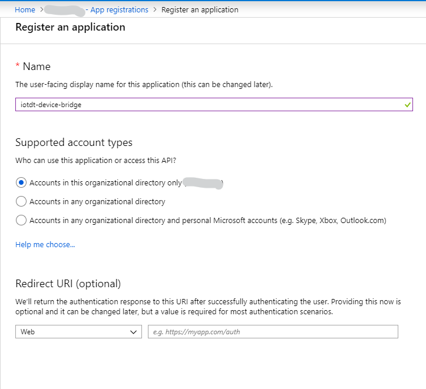
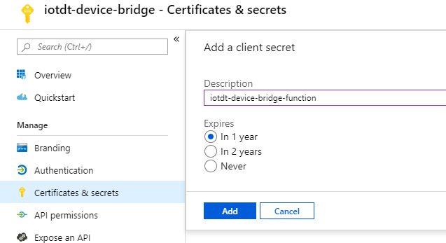
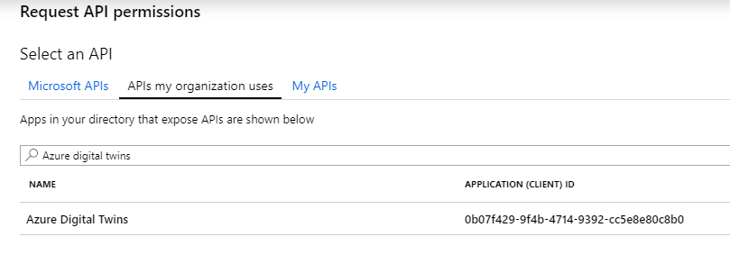
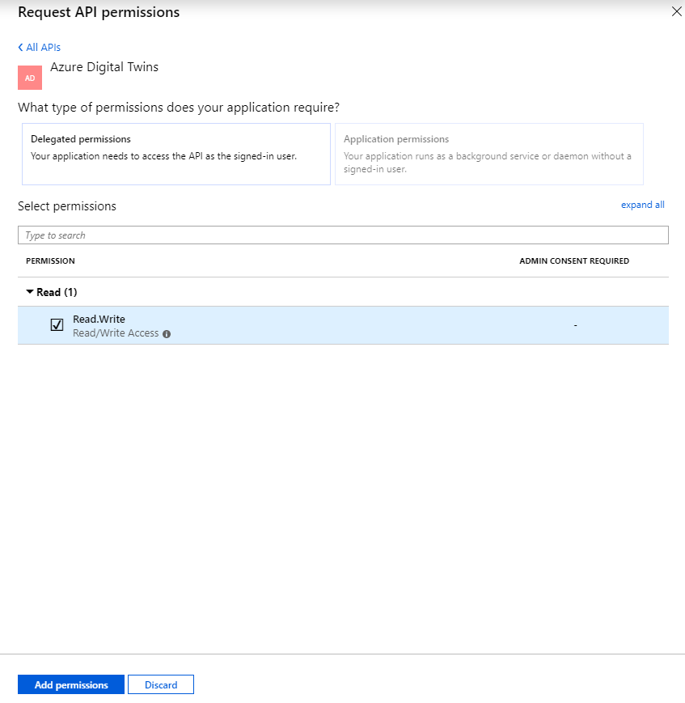

# Azure Application Registration and Azure Digital Twin role assignment
This document describes the steps to take to creat an application registration and digital twin role assignment that allows your service app to connect to Azure Digital Twin and read Device data. The procedure consists of the follwing steps:
- Register an Azure Application (service app)
- Retrieve the application object Id
- Assign an Azure Digital Twin role to the application (gateway device)

## Register an Azure Application (service app)
To allow the Azure Digital Twin Device Bridge to connect to Azure Digital Twin and retrieve the connection string for a device, a Azure Application with the correct settings has to be created. Follow these steps to create the application registration:

1. Open Azure portal and browse to the `Azure Active Directory` blade.
2. Open the `Application Registration` blade and add a new registration. Give the application registration a logical name (the name will be used to retrieve the object Id).

    

3. Once you've registered the application, open the registration and copy the `Application (client) ID` for later use. Then open the `Authentication` blade. Select the `Access tokens` and save the change.

    

4. Open the `Certificates & secrets` blade, create a client secret with the desired expiration, and copy and save the client secret value for later use. This can only be done at creation time. If you forgot to copy the value, you can create a new client secret at any time later.

    

5. Open the `API Permissions` blade and add permissions to read/write the Azure Digital Twin API. Find the API by using the `Add a permission` button and search the Azure Digital Twins API in the `APIs my organization uses` tab. 

    

6. Click on `Azure Digital Twins`, select the `Read.Write` permission and click the `Add permissions` button.

    

7. Once back in the `API permissions` blade, click the `Grant admin consent for ...` button to ensure consent is given to all users and services connecting.

The steps above have created an Azure Application Registration.

## Retrieve the application object Id
The Azure Active Directory object Id of the aplication will be used to create a role assignment in your Azure Digital Twin instance, so the Azure Digital Twin Device Bridge can connect to your instance to retrieve device connection strings.

Follow these steps to retrieve the `object Id`

1. Open Azure portal and open the `Cloud Shell`. Type in the following command:

```
Get-AzureRmADServicePrincipal -DisplayName '<your application registration name>'
```

2. Copy the `Id` GUID and save it for later use.

    

## Assign an Azure Digital Twin role to the application (gateway device)
To ensure the Azure Digital Twin Device Bridge can access you digital twin instance and retrieve the device connection string, you need to assign the Azure Application the role of gateway device. The easiest way to do this, is using the [Azure Digital Twin Graph Viewer](https://github.com/Azure/azure-digital-twins-graph-viewer). Deploy the viewer as a web app or run it locally as a docker container. 

Follow these steps to assign the role:

1. Once you've got the `Azure Digital Twin Graph Viewer` running, sign in to the viewer.

    

2. Once signed in click on `Execute API Call`. A slide-in window will appear. Provide the following details:
- API: roleassignments
- Method: POST
- JSON Input:
```json
{
    "roleId": "d4c69766-e9bd-4e61-bfc1-d8b6e686c7a8",
    "objectId": "<your application object Id (retrieved in the previous step)>",
    "objectIdType": "UserId",
    "tenantId": "<your Azure tenant Id>",
    "path": "/"
}
```

3. Click on the `Execute` button and a `Gateway Device` role will be assigned to your Azure application. If the role assignment was successful a role assignment Id will be provided in the JSON Output field.

> More information on roles that can be assigned can be found [here](https://docs.microsoft.com/en-us/azure/digital-twins/security-role-based-access-control#role-definitions).