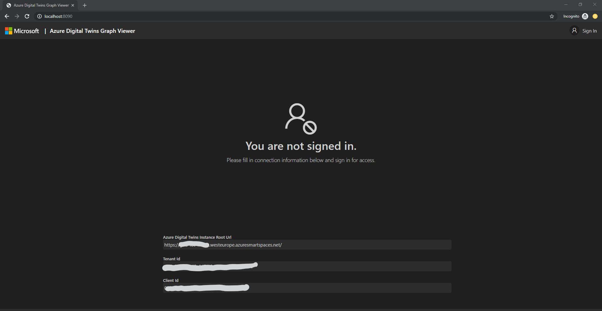
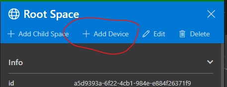

# Azure Digital Twin Device Bridge Module
This repository also contains the code to create an Azure Digital Twin Device Bridge Module. The module can be build and pushed into your own container registry and then be used in an Azure IoT Edge deployment. Azure IoT Edge is an Internet of Things (IoT) service that builds on top of IoT Hub. This service is meant for customers who want to analyze data on devices, a.k.a. "at the edge", instead of in the cloud. This service can be combined with Azure IoT Central to a powerfull platform that enables telemetry preprocessing as well as connectivity of legacy devices to Azure IoT Central. Next to this Azure IoT Edge also enables the use of standard and custom modules to extend the preprocessing power.

There are 2 directories in this repository related to the Device Bridge module:
- IOTDTBridgeModule: contains the code to run the device bridge as a IoT Edge module
- IOTDTTransformationModule: contains the code to create a module that transforms the output of the [Simulated Temperature Sensor module](https://azuremarketplace.microsoft.com/en-us/marketplace/apps/microsoft.edge-simulated-temperature-sensor-ga?tab=Overview) into JSON that can be routed to the device bridge module. Check the code to see what the transformation is.

> The assumption is that you know how to install an IoT Edge device and deploy modules. If not please check [here](https://docs.microsoft.com/en-us/azure/iot-edge/how-to-install-iot-edge-linux) for the basic steps of installing IoT Edge on Linux X64, and [here](https://docs.microsoft.com/en-us/azure/iot-edge/how-to-deploy-modules-portal) on how to deploy modules.

## Building the Azure Digital Twin Device Bridge Module
To build the `Azure Digital Twin Device Bridge Module` clone this repository to your local device, which has docker installed (using Linux containers). Then execute the command `docker build . -t iotdtbridgemodule` in the root directory of the repository. This will create a container that can then be pushed to your container registry. You can push the container by frst tagging it with your container registry name and a version tag `docker tag iotdtbridgemodule <your container registry>/iotdtbridgemodule:<version>`, and then push it using `docker push <your container registry>/iotdtbridgemodule:<version>`. 

## Building the IOTDTTransformationModule module
Execute the command `docker build . -t iotdttransformationmodule` in the IOTDTTransformationModule directory of the repository. This will create a container that can then be pushed to your container registry. You can push the container by first tagging it with your container registry name and a version tag `docker tag iotdttransformationmodule <your container registry>/iotdttransformationmodule:<version>`, and then push it using `docker push <your container registry>/iotdttransformationmodule:<version>`. 

## Example: Deploy the Device Bridge and Transformation Module
This example describes the steps to deploy the modules above to an Azure IoT Edge. The steps to create this example are similar to deploying the Azure Digtal Twin Device Bridge as an Azure Function.

To use the device bridge module solution, you will need the following:
- an Azure account. You can create a free Azure account from [here](https://aka.ms/aft-iot)
- an Azure Digital Twin application to connect the devices. Create an Azure Digital Twin by following [this tutorial](https://docs.microsoft.com/en-us/azure/digital-twins/tutorial-facilities-setup). You can use the open source [Azure Digital Twin Graph Viewer](https://github.com/Azure/azure-digital-twins-graph-viewer) to interact with the digital twin through a web front-end.
- an Azure Application Registration and Azure Digital Twin role assignment, which gives your Azure Digital Twin Device Bridge access rights to your Azure Digital Twin service. A step by step manual can be found on the [Application Registration page](APPLICATIONREGISTRATION.md).
- an Azure IoT Edge device deployment.

### Create a Azure Digital Twin using the Azure Digital Twin Graph Viewer
The 'Azure Digital Twin Device Bridge Module' in this example will send the messages in a specific format to your Azure Digital Twin instance. To ensure your Digital Twin is setup to receive those messages, use 'Azure Digital Twin Graph Viewer' to create the correct structure. Deploy the viewer as a web app or run it locally as a docker container. Create the `device1` device as used below in the module.


Follow these steps to create the digital twin:

1. Once you've got the `Azure Digital Twin Graph Viewer` running, sign in to the viewer.

    

2. Select a `space` and click `+ Add Device` to add a device. Use `device1` as the `Hardware ID`.

    

3. Add 4 sensors to the created device. Use the following `Hardware ID`'s, representing the 4 values that will be send from the `Simulated Temperature Sensor` below, and use the correct `Data Type` and `Data Unit Type`.
    ```
    ambient_humidity        Humidity (ID: 17)       % (ID: 40)
    ambient_temperature     Temperature (ID: 18)    °C (ID: 38)
    machine_temperature     Temperature (ID: 18)    °C (ID: 38)
    machine_pressure        Pressure (ID: 24)       psi (ID: 34)
    ```

### Deploy the modules to your Azure IoT Edge device (Azure Portal)
Once you've built the modules as describe above and provisioned all necessary pre-requisites, you can deploy the modules to your Azure IoT Edge device. Take the following steps to deploy the modules:
1. Open the `Azure Portal`, browse to your `Azure IoT Hub` blade, and create a new IoT Edge device.

    

2. Open your `IoT Edge` management blade, and click `Set Modules`.

    

3. Add the `iotdtbridgemodule` described above as `IoT Edge Module`, with the following parameters:
    ```
    Name: iotdtbridgemodule
    Image Uri: <your container registry>/iotdtbridgemodule:<version>
    Environment Variables:
        ClIENT_ID = <Your application Id>
        CLIENT_SECRET = <Your client secret>;
        AUTHORITY_HOST_URL: https://login.microsoftonline.com/<your tenant name>.onmicrosoft.com/oauth2/token
        IOTDT_API_URL: https://<your digital twin name>.<location>.azuresmartspaces.net/
    ```

4. Add the `iotdttransformationmodule` described above as `IoT Edge Module`, with the following parameters:
    ```
    Name: iotdttransformationmodule
    Image Uri: <your container registry>/iotdttransformationmodule:<version>
    ```

5. Add the `Simulated Temperature Sensor` as `IoT Edge Module`, with the following parameters:
    ```
    Name: SimulatedTemperatureSensor
    Image Uri: mcr.microsoft.com/azureiotedge-simulated-temperature-sensor:1.0
    Set module twin's desired properties:
        {
            "properties.desired": {
                "SendData": true,
                "SendInterval": 5
            }
        }
    ```

6. Click `Next` at the bottom of the page and specify the route:
    ```json
    {
        "routes": {
            "TarnformatorToBridge": "FROM /messages/modules/iotdttransformationmodule/outputs/* INTO BrokeredEndpoint(\"/modules/iotdtbridgemodule/inputs/iotc\")",
            "SimulatedToTransformator": "FROM /messages/modules/SimulatedTemperatureSensor/outputs/* INTO BrokeredEndpoint(\"/modules/iotdttransformationmodule/inputs/<device hardware Id>\")",
            "upstream": "FROM /messages/modules/SimulatedTemperatureSensor/outputs/* INTO $upstream"
        }
    }
    ```

7. Click `Next` and `Submit` at the bottom of the page. The IoT Edge is now deployed and will start sending messages to your digial twin.

> The &lt;device hardware Id&gt; in the route above is the one that you created in your Azure Digital twin.

> The `Simulated Temperature Sensor` sends out 500 messages and then stops sending. If you want to restart sending messages, restart the module on the IoT Edge by executing the command `iotedge restart SimulatedTemperatureSensor` at a prompt.

