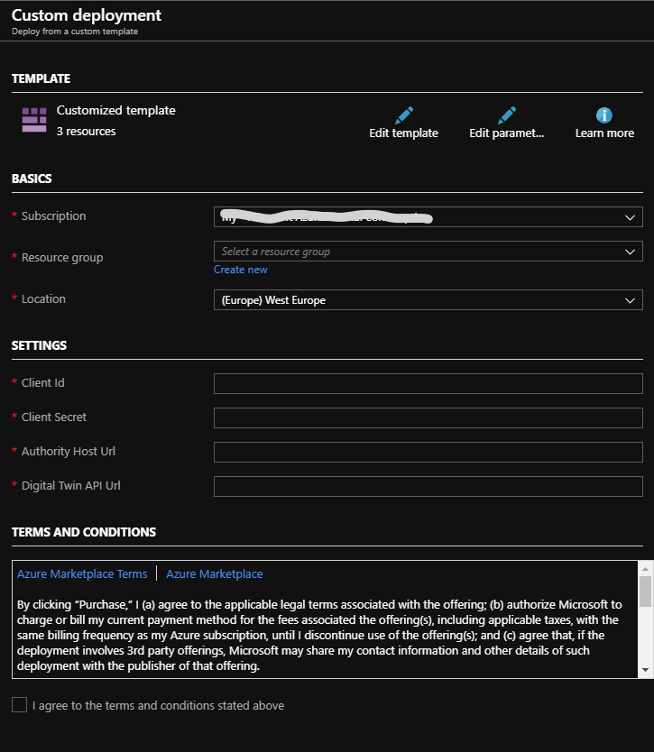
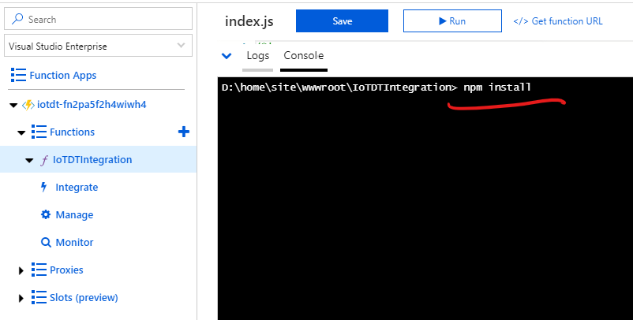
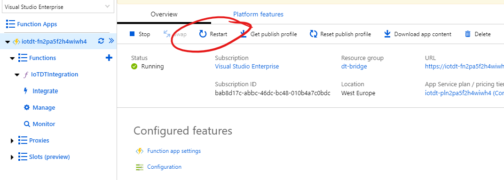
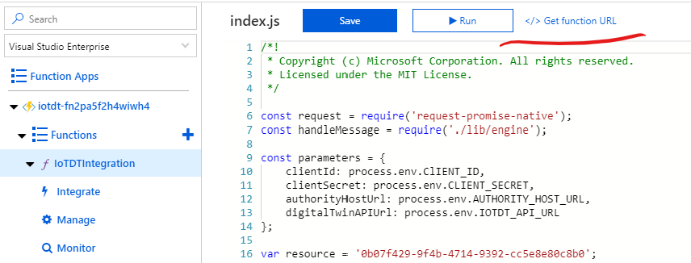

# Azure Digital Twin Device Bridge
This repository contains everything you need create a device bridge to connect other IoT clouds such as Sigfox, Particle, and The Things Network (TTN) to Azure Digital Twin. The device bridge forwards the messages your devices send to other clouds to your Azure Digital Twin. This solution will provision several Azure resources into your Azure subscription that work together to transform and forward device messages through a webhook integration in Azure Functions.

> This repository is based on the IoT Central device bridge, which can be found [here](https://github.com/Azure/iotc-device-bridge).

To use the device bridge solution, you will need the following:
- an Azure account. You can create a free Azure account from [here](https://aka.ms/aft-iot)
- an Azure Digital Twin application to connect the devices. Create an Azure Digital Twin by following [this tutorial](https://docs.microsoft.com/en-us/azure/digital-twins/tutorial-facilities-setup). You can use the open source [Azure Digital Twin Graph Viewer](https://github.com/Azure/azure-digital-twins-graph-viewer) to interact with the digital twin through a web front-end.
- an Azure Application Registration and Azure Digital Twin role assignment, which gives your Azure Digital Twin Device Bridge access rights to your Azure Digital Twin service. A stpe by step manual can be found in the [Application Registration page](APPLICATIONREGISTRATION.md).

[](https://portal.azure.com/#create/Microsoft.Template/uri/https%3A%2F%2Fraw.githubusercontent.com%2Fgbbiotwesouth%2Fiotdt-device-bridge%2Fmaster%2Fazuredeploy.json)

## Instructions
Take the following steps to deploy an Azure Function into your subscription and set up the device bridge.

1. Create an Azure Digital Twin instance and an Azure application registration as mentoined above.

2. Click the `Deploy to Azure` button above. This opens up a custom ARM template in the Azure Portal to deploy the Azure Function. Provide the details as saved in the Azure Application Registration steps, when deploying the template:
- Client Id: &lt;Your application Id&gt;
- Client Secret: &lt;Your client secret&gt;
- Authority Host Url: https://login.microsoftonline.com/&lt;your tenant name&gt;.onmicrosoft.com/oauth2/token
- Digital Twin API Url: https://&lt;your digital twin name&gt;.&lt;location&gt;.azuresmartspaces.net/



3. After the deployment is done, install the required NPM packages in the function. To do this,
go to the Function App that was deployed to your subscription in the `Functions > IoTDTIntegration > Console` tab.
In the console, run the command `npm install` (this command takes ~20 minutes to complete, so feel free to do something else in that time).



4. After the package installation finishes, the Function App needs to be restarted by clicking the
`Restart` button in `Overview` page.



5. The function is now ready to use. External systems can feed device data through this device bridge and into your Azure Digital Twin by making HTTP POST requests to the function URL. The URL can be obtained in the newly created function App in `Functions > IoTDTIntegration > Get function URL`.



Messages sent to the device bridge must have the following format in the body:
```json
{
    "device": {
        "deviceId": "<device hardware Id>"
    },
    "measurements": {
        "<sensor hardware Id 1>": 20.31,
        "<sensor hardware Id 2>": 50,
        "<sensor hardware Id 3>": 8.5,
        "<sensor hardware Id ..>": ...
    }
}
```

An optional `timestamp` field can be included in the body, to specify the UTC date and time of the message.
This field must be in ISO format (e.g., YYYY-MM-DDTHH:mm:ss.sssZ). If `timestamp` is not provided,
the current date and time will be used.

> NOTE: `deviceId` must be the hardware Id as specified in the Azure Digital Twin. The fields in `measurements` must be the sensor hardware Id as created in Azure Digital Twin, and values of the fields in `measurements` must be numbers or strings. Alignment between the sending platform and the Azure Digital Twin hardware Id naming needs to be taken into account, when provisioning the Azure Digital Twin.

## What is being provisioned? (pricing)
The custom template in this repository will provision the following Azure resources:
- Storage Account
- Function App
- Consumption Plan

The Function App runs on a [consumption plan](https://azure.microsoft.com/en-us/pricing/details/functions/).
While this option does not offer dedicated compute resources, it allows device bridge to handle
**hundreds of device messages per minute**, suitable for smaller fleets of devices or devices that send messages less frequently.
If your application depends on streaming a large number of device messages, you may choose to replace the
consumption plan by dedicated a [App Service Plan](https://azure.microsoft.com/en-us/pricing/details/app-service/windows/).
This plan offers dedicated compute resources, which leads to faster server response times.
Using a standard App Service Plan, the maximum observed performance of the Azure Function in this repository was around
**1,500 device messages per minute**. You can learn more about the [Azure Function hosting options
in documentation](https://docs.microsoft.com/en-us/azure/azure-functions/functions-scale).

To use a dedicated App Service Plan instead of a consumption plan, edit the custom template before deploying. Click the `Edit template` button.

 
  
Replace the segment
```json
{
  "type": "Microsoft.Web/serverfarms",
  "apiVersion": "2015-04-01",
  "name": "[variables('planName')]",
  "location": "[resourceGroup().location]",
  "properties": {
    "name": "[variables('planName')]",
    "computeMode": "Dynamic",
    "sku": "Dynamic"
  }
},
```
with
```json
{
  "type": "Microsoft.Web/serverfarms",
  "sku": {
      "name": "S1",
      "tier": "Standard",
      "size": "S1",
      "family": "S",
      "capacity": 1
  },
  "kind": "app",
  "name": "[variables('planName')]",
  "apiVersion": "2016-09-01",
  "location": "[resourceGroup().location]",
  "tags": {
      "iotCentral": "device-bridge",
      "iotCentralDeviceBridge": "app-service-plan"
  },
  "properties": {
      "name": "[variables('planName')]"
  }
},
```
Additionally, edit the template to include `"alwaysOn": true` in the configurations of the Function App resource (under `properties > siteConfig`, right before `appSettings`). The [alwaysOn configuration](https://github.com/Azure/Azure-Functions/wiki/Enable-Always-On-when-running-on-dedicated-App-Service-Plan) ensures that the function app is running at all times.

## Example 1: Connecting Particle devices through the device bridge
To connect a Particle device through the device bridge to Azure Digital Twin, go to the Particle console and create a new webhook integration. Set the `Request Format` to `JSON` and, under `Advanced Settings`, use the following custom body format:

```
{
  "device": {
    "deviceId": "{{{PARTICLE_DEVICE_ID}}}"
  },
  "measurements": {
    "{{{PARTICLE_EVENT_NAME}}}": {{{PARTICLE_EVENT_VALUE}}}
  }
}

```

> When provisioning Azure Digital Twin for use with Particle devices, make sure you use `PARTICLE_DEVICE_ID` as the device hardware Id, and `PARTICLE_EVENT_NAME` as the sensor hardware Id.

## Example 2: Connecting Sigfox devices through the device bridge
Some platforms may not allow you to specify the format of device messages sent through a
webhook. For such systems, the message payload must be converted to the expected body format
before it can be processed by the device bridge. This conversion can be performed in the same
Azure Function that runs the device bridge.

In this section, we demonstrate this concept by showing how the payload of a Sigfox webhook
integration can be converted to the body format expected by this solution. Device data is
transmitted from the Sigfox cloud in a hexadecimal string format. For convenience, we have
provided a conversion function for this format, which accepts a subset of the possible
field types in a Sigfox device payload (`int` and `uint` of 8, 16, 32, or 64 bits;
`float` of 32 or 64 bits; `little-endian` and `big-endian`). To process messages from a
Sigfox webhook integration, the following changes are needed to the `IoTDTIntegration/index.js`
file of the Function App:

- To convert the message payload, add the following code **before** the call to `handleMessage`
in line 21 (replacing `payloadDefinition` by your Sigfox payload definition):

```javascript
const payloadDefinition = 'gforce::uint:8 lat::uint:8 lon::uint:16'; // Replace this with your payload definition

req.body = {
    device: {
        deviceId: req.body.device
    },
    measurements: require('./converters/sigfox')(payloadDefinition, req.body.data)
};
```

- Sigfox devices expect a `204` response code. To do this, add the following code snippet
**after** the call to `handleMessage` in line 21:

```javascript
context.res = {
    status: 204
};
```

## Example 3: Connecting devices from The Things Network through the device bridge
Devices in The Things Network (TTN) can be easily connected to Azure Digital Twin through this solution.
To do so, add a new HTTP integration to you application in The Things Network console (`Application > Integrations > add integration > HTTP Integration`).
Also make sure that your application has a decoder function defined (`Application > Payload Functions > decoder`),
so the payload of your device messages can be automatically converted to JSON before being sent to
the Azure Function. In the following sample, we show a JavaScript decoder function that can be used
to decode common numeric types from binary data.

```javascript
function Decoder(bytes, port) {
    function bytesToFloat(bytes, decimalPlaces) {
        var bits = (bytes[3] << 24) | (bytes[2] << 16) | (bytes[1] << 8) | bytes[0];
        var sign = (bits >>> 31 === 0) ? 1.0 : -1.0;
        var e = bits >>> 23 & 0xff;
        var m = (e === 0) ? (bits & 0x7fffff) << 1 : (bits & 0x7fffff) | 0x800000;
        var f = Math.round((sign * m * Math.pow(2, e - 150)) * Math.pow(10, decimalPlaces)) / Math.pow(10, decimalPlaces);
        return f;
    }

    function bytesToInt32(bytes, signed) {
        var bits = bytes[0] | (bytes[1] << 8) | (bytes[2] << 16) | (bytes[3] << 24);
        var sign = 1;

        if (signed && bits >>> 31 === 1) {
            sign = -1;
            bits = bits & 0x7FFFFFFF;
        }

        return bits * sign;
    }

    function bytesToShort(bytes, signed) {
        var bits = bytes[0] | (bytes[1] << 8);
        var sign = 1;

        if (signed && bits >>> 15 === 1) {
            sign = -1;
            bits = bits & 0x7FFF;
        }

        return bits * sign;
    }

    return {
        <sensor hardware Id 1>: bytesToFloat(bytes.slice(0, 4), 2),
        <sensor hardware Id 2>: bytesToInt32(bytes.slice(4, 8), true),
        <sensor hardware Id 3>: bytesToShort(bytes.slice(8, 10), false)
    };
}
```

After the integration has been defined, add the following code **before** the call to `handleMessage`
in the `IoDTIntegration/index.js` file of your Azure Function. This will translate
the body of your HTTP integration to the expected format.

```javascript
req.body = {
    device: {
        deviceId: req.body.hardware_serial
    },
    measurements: req.body.payload_fields
};
```

> When provisioning Azure Digital Twin for use with The Things Network devices, make sure you use `hardware_serial` as the device hardware Id, and `<sensor hardware Id>` used in the decoder as the sensor hardware Id.

## Limitations
This device bridge only forwards messages to Azure Digital Twin, and does not send messages back to devices. Due to the unidirectional nature of the current implementation of Azure Digital Twin and this solution, `settings` and `commands` will **not** work for devices that connect to Azure Digital Twin through this device bridge. 

## Package integrity
The template provided here deploys a packaged version of the code in this repository to an Azure
Function. You can check the integrity of the code being deployed by verifying that the `SHA256` hash
of the `iotdt-bridge-az-function.zip` file in the root of this repository matches the following:

```
<SHA256 Key>
```

# Contributing

This project has adopted the [Microsoft Open Source Code of Conduct](https://opensource.microsoft.com/codeofconduct/).
For more information see the [Code of Conduct FAQ](https://opensource.microsoft.com/codeofconduct/faq/) or
contact [opencode@microsoft.com](mailto:opencode@microsoft.com) with any additional questions or comments.
